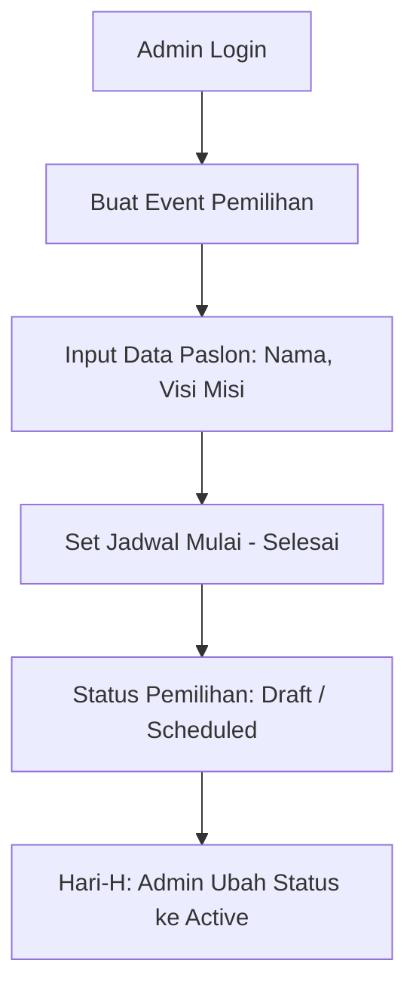
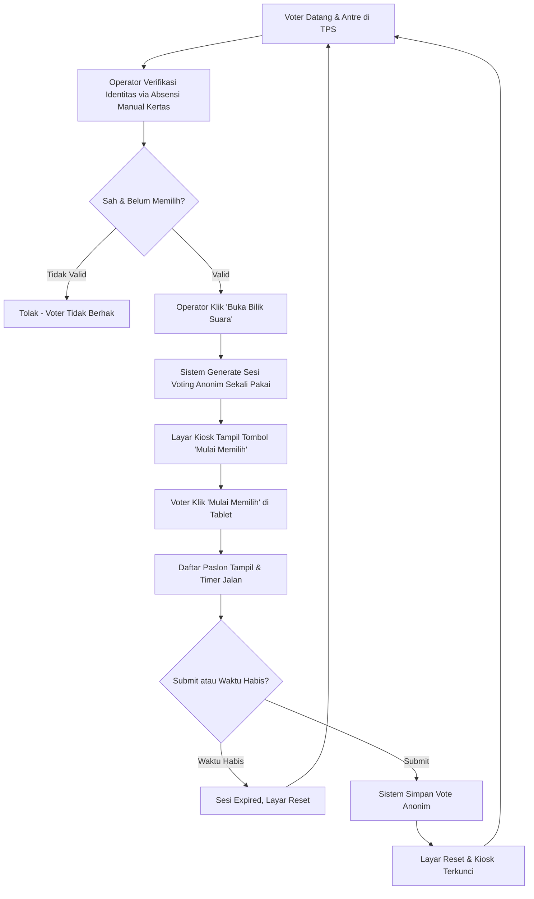
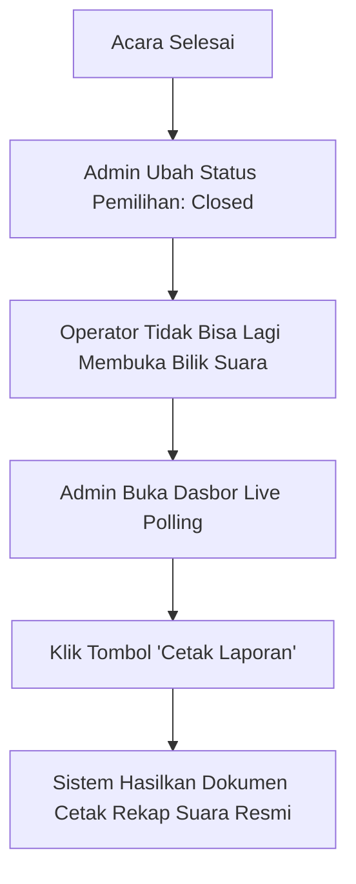
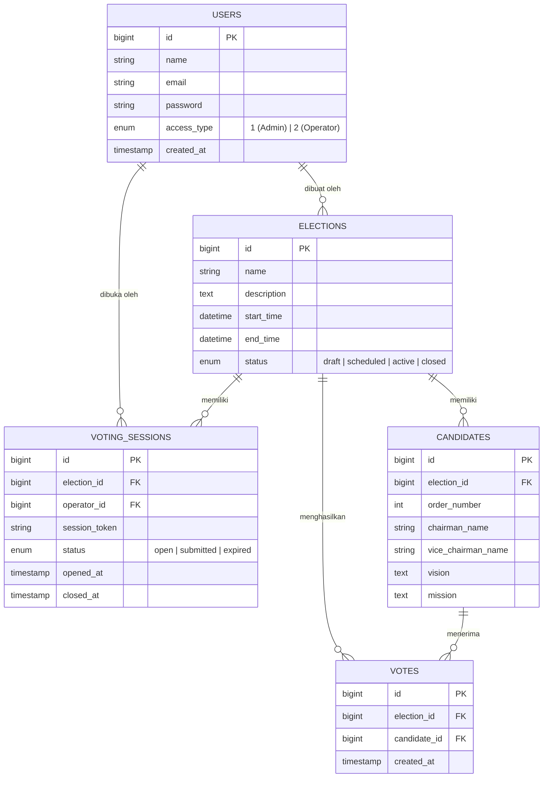

# PRD - SmartVoting

**Versi:** 1.0 (Final MVP)
**Tanggal:** 10 Agustus 2026
**Tipe Sistem:** Single-tenant, multi-election (1 instalasi = 1 sekolah/univ/organisasi, bisa kelola banyak event pemilihan)
**Tech Stack:** Laravel (starter kit existing) + Blade + MySQL/PostgreSQL

---

## 1. Latar Belakang & Tujuan

SmartVoting adalah sistem e-voting berbasis kiosk/bilik suara digital untuk pemilihan internal organisasi (OSIS, Ketua BEM, dsb). Berbeda dari e-voting berbasis login individual, sistem ini menggunakan **alur pemilihan on-site dengan verifikasi absensi manual (kertas)**: voter datang ke TPS, mengantre, diverifikasi kehadirannya secara manual oleh operator, lalu operator membukakan satu sesi voting anonim (sekali pakai) di layar/kiosk.

Tujuan utama:
- Digitalisasi proses pemungutan & penghitungan suara agar cepat, *real-time*, dan akurat.
- Menjaga kerahasiaan pilihan voter (anonimitas suara 100%, sistem tidak mencatat identitas pemilih).
- Mencegah kecurangan (double voting) dengan kontrol fisik oleh operator.
- Mendukung banyak event pemilihan dalam satu instalasi.

---

## 2. Role & Tanggung Jawab

### 2.1 Admin
- Membuat & mengelola **event pemilihan** (nama, jadwal mulai-selesai, deskripsi).
- Mengelola **paslon** (nama ketua, wakil, visi, misi, nomor urut) per pemilihan.
- Mengelola akun (CRUD user admin dan operator).
- Mengontrol **status pemilihan** secara manual (*Draft, Scheduled, Active, Closed*).
- Melihat **rekap hasil** secara *real-time* (Live Polling) di Dasbor.
- Mencetak laporan akhir perolehan suara (PDF/Print).

### 2.2 Operator
- Melihat daftar pemilihan yang berstatus aktif (*Active*).
- Berjaga di meja TPS untuk melakukan **absensi manual (kertas)** terhadap pemilih yang datang.
- **Membuka bilik suara** untuk pemilih (men-generate sesi voting anonim sekali pakai).
- Memantau jumlah total suara masuk dan jumlah sesi bilik yang sedang menyala/aktif.
- Tidak bisa melihat hasil perolehan suara paslon secara detail (hanya Admin yang bisa).

### 2.3 Voter (tanpa akun)
- Tidak perlu login ke sistem.
- Antre secara fisik di TPS dan melapor ke Operator.
- Setelah diverifikasi absensinya secara manual oleh operator, mendapat akses satu kali ke layar bilik (tablet/kiosk).
- Memilih 1 paslon, submit, sesi otomatis ditutup dan layar terkunci untuk pemilih berikutnya.

---

## 3. Matriks Hak Akses

| Fitur                                   | Admin | Operator | Voter |
|------------------------------------------|:---:|:---:|:---:|
| CRUD Pemilihan (event)                   | ✅  | ❌  | ❌  |
| CRUD Paslon                              | ✅  | ❌  | ❌  |
| Kelola Akun Admin/Operator               | ✅  | ❌  | ❌  |
| Ubah Status Event (Manual Active/Closed) | ✅  | ❌  | ❌  |
| Generate Sesi Voting per Voter           | ❌  | ✅  | ❌  |
| Submit Suara                             | ❌  | ❌  | ✅ (via kiosk, anonim) |
| Pantau Live Polling & Hasil Detail       | ✅  | ❌  | ❌  |
| Cetak Laporan Hasil Akhir                | ✅  | ❌  | ❌  |

---

## 4. Alur Sistem (Flowchart)

### 4.1 Alur Persiapan (Admin)

### 4.2 Alur Voting di TPS (Operator + Voter)

### 4.3 Alur Penutupan & Rekap

---

## 5. Entity Relationship Diagram (ERD)

Prinsip kunci desain data: **Tidak ada tabel `voters` (DPT Digital)**. Sistem mengadopsi _trust-based manual verification_. Suara masuk 100% anonim dan tidak bisa ditelusuri kembali ke pemilih manapun.

**Catatan penting relasi:**
- `VOTES` hanya mencatat `election_id` dan `candidate_id`. Tidak ada jejak siapa pemilihnya, apalagi karena DPT digital dihapus.
- `VOTING_SESSIONS` mencatat sesi yang digenerate oleh operator, namun setelah digunakan (di-submit), sesi ini hangus dan tertutup rapat. Tidak ada *link* antara session token dengan row di tabel `VOTES`.

---

## 6. System Design

### 6.1 Arsitektur (Disesuaikan)
- **Desain MVC:** Terdapat pemisahan tegas menggunakan pola *Controller → Usecase → Database*. Controller tidak boleh melakukan query DB secara langsung (termasuk fitur statistik di Dasbor & Operator telah diekstraksi ke `LivePollingUsecase`).
- **Absensi Manual:** Keputusan sistem membuang fungsionalitas DPT (Daftar Pemilih Tetap) digital demi simplisitas. Anti-*double-voting* sepenuhnya menjadi tanggung jawab Operator TPS menggunakan daftar absensi konvensional/kertas.

### 6.2 Mekanisme Kiosk (Sekali Pakai)
1. Operator di meja TPS login dan melihat daftar event aktif.
2. Setelah Operator memverifikasi fisik pemilih (absensi kertas), ia menekan **"Buka Bilik Suara"**.
3. Sistem men-generate `session_token` (UUID), dan mengarahkan browser tablet Kiosk ke URL voting (tanpa login).
4. Layar awal di bilik menampilkan instruksi. Saat tombol "Mulai Memilih" diklik, pilihan paslon muncul.
5. Begitu suara di-submit:
   - Data suara tercatat di tabel `votes`.
   - Token sesi langsung *expired* (hangus).
   - Layar otomatis kembali ke posisi *idle*/terkunci, menunggu Operator membukakan token baru untuk antrean berikutnya.

### 6.3 Otomatisasi Status (Dibatalkan)
Sistem **tidak** menggunakan pemblokiran otomatis berbasis waktu secara presisi. Kontrol status event sepenuhnya dilakukan **secara manual oleh Admin**. Selama Admin men-set statusnya menjadi "Active", maka operator bisa menggunakan sistem (meskipun sudah lewat tanggal `end_time`).

### 6.4 Live Polling & Laporan Cetak
Dasbor Admin menayangkan matriks *Live Polling* secara *real-time*. Di setiap kotak pemilihan yang berjalan maupun yang telah ditutup (*Closed*), tersedia fitur **Cetak Laporan** yang dirancang responsif tanpa embel-embel menu *sidebar*, agar siap dicetak PDF sebagai berita acara resmi hasil pemilihan.
