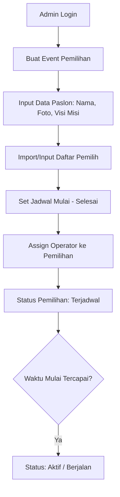
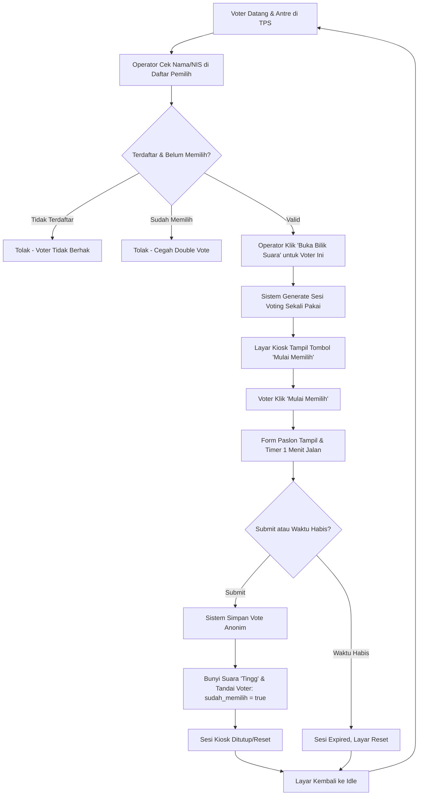
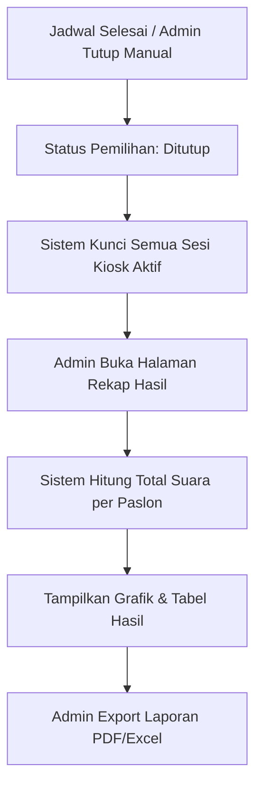
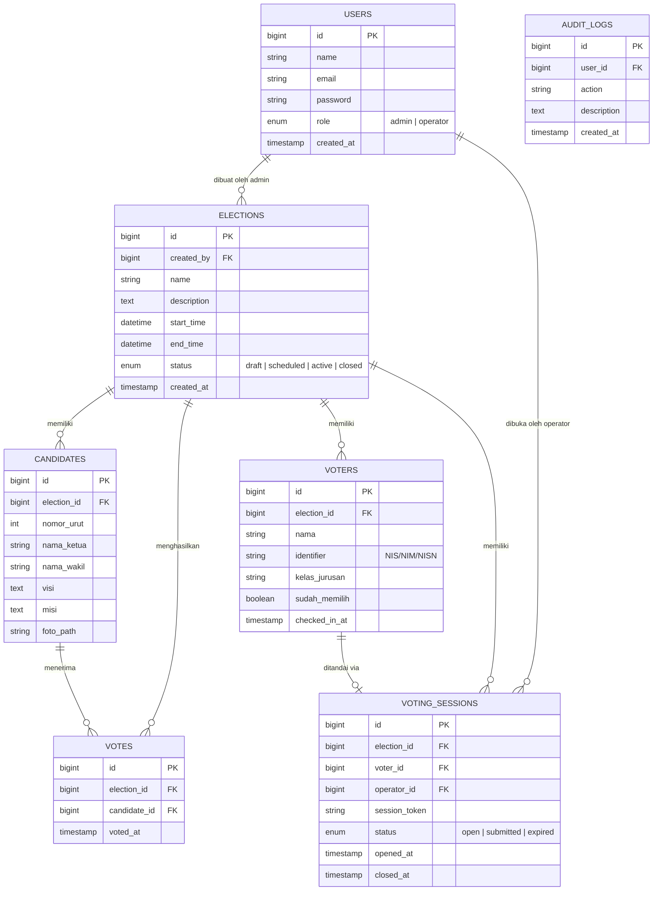

# PRD - SmartVoting

**Versi:** 0.1 (Draft)
**Tanggal:** 8 Agustus 2026
**Tipe Sistem:** Single-tenant, multi-election (1 instalasi = 1 sekolah/univ/organisasi, bisa kelola banyak event pemilihan)
**Tech Stack:** Laravel (starter kit existing) + Blade/Livewire + MySQL/PostgreSQL

---

## 1. Latar Belakang & Tujuan

SmartVoting adalah sistem e-voting berbasis kiosk/bilik suara digital untuk pemilihan internal organisasi (OSIS, Ketua BEM, dsb). Berbeda dari e-voting berbasis login individual, sistem ini meniru alur pemilihan fisik konvensional: voter datang ke TPS, mengantre, diverifikasi kehadirannya oleh operator, lalu diberi akses satu kali ke layar/device untuk memilih. Suara yang tercatat **tidak terikat ke identitas voter**, hanya status "sudah memilih" yang tercatat untuk mencegah voter memilih dua kali.

Tujuan utama:
- Digitalisasi proses pemungutan & penghitungan suara agar cepat dan akurat
- Menjaga kerahasiaan pilihan voter (anonimitas suara)
- Mencegah kecurangan (double voting, manipulasi hasil)
- Mendukung banyak event pemilihan dalam satu instalasi (misal OSIS & MPK berjalan terpisah/bersamaan)

---

## 2. Role & Tanggung Jawab

### 2.1 Admin
- Membuat & mengelola **event pemilihan** (nama, jadwal mulai-selesai, deskripsi)
- Mengelola **paslon** (nama, foto, visi, misi, nomor urut) per pemilihan
- Mengelola **daftar pemilih** (import Excel/CSV, tambah/edit/hapus manual) per pemilihan
- Mengelola akun (crud user admin dan operator)
- Melihat **rekap hasil & laporan** (real-time & final)
- Menutup pemilihan lebih awal / memperpanjang jadwal
- Export hasil (PDF/Excel)

### 2.2 Operator
- Melihat daftar pemilihan yang sedang aktif/berjalan sesuai jadwal
- Menyiapkan **device/bilik suara** (kiosk) untuk pemilihan tertentu
- **Membuka form/bilik suara** untuk satu voter dalam satu waktu (generate sesi voting sekali pakai)
- Memantau jumlah suara masuk & sisa voter secara real-time
- Tidak bisa mengubah data paslon, pemilihan, atau melihat siapa memilih siapa

### 2.3 Voter (tanpa akun)
- Tidak login ke sistem
- Antre secara fisik di TPS
- Setelah diverifikasi operator, mendapat akses satu kali ke layar pemilihan
- Memilih 1 paslon, submit, sesi otomatis ditutup/reset untuk voter berikutnya

---

## 3. Matriks Hak Akses

| Fitur                                   | Admin | Operator | Voter |
|------------------------------------------|:---:|:---:|:---:|
| CRUD Pemilihan (event)                    | ✅  | ❌  | ❌  |
| CRUD Paslon                               | ✅  | ❌  | ❌  |
| Import/Kelola Daftar Pemilih              | ✅  | ❌  | ❌  |
| Kelola Akun Operator                      | ✅  | ❌  | ❌  |
| Aktifkan/Buka Sesi Voting per Voter       | ❌  | ✅  | ❌  |
| Verifikasi Kehadiran Voter                | ❌  | ✅  | ❌  |
| Submit Suara                              | ❌  | ❌  | ✅ (via kiosk, tanpa akun) |
| Lihat Rekap/Hasil Real-time               | ✅  | ✅ (terbatas) | ❌  |
| Export Laporan Hasil                      | ✅  | ❌  | ❌  |
| Tutup Pemilihan                           | ✅  | ❌  | ❌  |

---

## 4. Alur Sistem (Flowchart)

### 4.1 Alur Persiapan (Admin)

### 4.2 Alur Voting di TPS (Operator + Voter)

### 4.3 Alur Penutupan & Rekap

---

## 5. Entity Relationship Diagram (ERD)

Prinsip kunci desain data: **tabel `votes` tidak punya foreign key ke voter** — ini yang menjaga anonimitas. Status "sudah memilih" disimpan terpisah di tabel `voters` (daftar hadir), bukan di tabel suara.

**Catatan penting relasi:**
- `VOTES` hanya berelasi ke `ELECTIONS` dan `CANDIDATES` — **tidak ada kolom `voter_id`**. Ini disengaja untuk menjaga kerahasiaan suara.
- `VOTING_SESSIONS` adalah penghubung sementara: mencatat *siapa yang sedang diberi akses ke bilik suara*, bukan *pilihannya apa*. Setelah submit, session ditutup dan `voters.sudah_memilih` di-update — tapi tetap tidak ada link ke baris di `votes`.
- `AUDIT_LOGS` mencatat aksi admin/operator (buat pemilihan, buka sesi, dsb), bukan pilihan voter.

---

## 6. System Design

### 6.1 Arsitektur

- **Pola:** Monolith Laravel (MVC), sesuai starter kit yang sudah ada
- **Frontend:** Blade + Livewire (atau Alpine.js) untuk interaksi kiosk yang butuh reaktivitas tanpa full reload (real-time turnout counter, layar kiosk)
- **Database:** MySQL/PostgreSQL (sesuaikan starter kit)
- **Auth:** Laravel default auth (Breeze/Jetstream/Fortify — sesuai starter kit) hanya untuk Admin & Operator. Voter **tidak** menggunakan sistem auth Laravel.

### 6.2 Mekanisme Kiosk (Bagian Paling Kritis)

Karena voter tidak login, keamanan & anti-fraud harus ditangani di level *session token*, bukan di level auth user:

1. Operator login sebagai dirinya sendiri di device kiosk (atau device sudah terautentikasi ke operator yang bertugas)
2. Operator memilih voter dari daftar pemilih → klik "Buka Bilik Suara"
3. Backend generate `session_token` unik (UUID), simpan row baru di `voting_sessions` dengan status `open`, terikat ke `election_id` + `voter_id` + `operator_id`
4. Browser/device di-redirect ke route khusus, misal `/bilik/{session_token}` — route ini **tidak butuh login**, validasi cukup lewat token. Layar awal menampilkan tombol "Mulai Memilih".
5. Saat voter klik "Mulai Memilih", form paslon muncul dan timer frontend 1 menit berjalan.
6. Token bersifat **sekali pakai**: begitu voter submit pilihan, backend:
   - Insert row ke `votes` (election_id + candidate_id saja)
   - Update `voting_sessions.status = submitted`
   - Update `voters.sudah_memilih = true`
   - Bunyikan audio notifikasi ("Tingg") sebagai tanda sukses.
   - Token langsung invalid untuk request berikutnya
7. **Manajemen Expiry (Timeout Dua Fase)**:
   - Fase Tunggu: Waktu dari operator buka sesi sampai voter klik "Mulai Memilih" (misal batas 3-5 menit).
   - Fase Pilih: Waktu setelah klik "Mulai Memilih" (batas strict 1 menit). Jika waktu habis sebelum submit, token ditutup (`status = expired`) dan layar reset. Operator perlu generate ulang jika voter masih berhak.

Ini mencegah:
- Voter memilih dua kali (dicegah di level `voters.sudah_memilih` + status `voting_sessions`)
- Orang lain mengakses layar vote tanpa dibuka operator dulu (token hanya dibuat lewat aksi operator)
- Refresh/back button dipakai untuk vote ulang (token expired setelah submit)
- Sesi menggantung lama karena ada batas waktu dua tahap.

### 6.3 Multi-Election dalam Satu Instalasi

- Semua tabel inti (`candidates`, `voters`, `voting_sessions`, `votes`) punya `election_id`
- Operator saat login melihat daftar pemilihan yang statusnya `active` dan dia ditugaskan (bisa via tabel pivot `election_operator` jika perlu assignment eksplisit)
- Dashboard admin bisa switch antar pemilihan untuk lihat rekap masing-masing secara terpisah
- Tidak ada isolasi database/tenant terpisah — cukup filter `WHERE election_id = ?` di semua query (karena ini single-tenant per instalasi)

### 6.4 Real-time Turnout (Opsional, Nice-to-have)

- Gunakan Laravel Echo + Reverb/Pusher, atau cukup polling Livewire tiap beberapa detik
- Yang di-broadcast: jumlah total suara masuk & sisa voter belum memilih (bukan detail pilihan) — supaya admin bisa pantau progres tanpa membocorkan hasil sebelum pemilihan ditutup
- Pertimbangan: sebaiknya hasil per-paslon **disembunyikan** dari operator/admin selama pemilihan masih `active`, baru tampil setelah status `closed`, untuk menjaga integritas proses

### 6.5 Keamanan

- Rate limiting pada route `/bilik/{token}` untuk cegah brute-force token
- Token pakai UUID v4 (bukan auto-increment ID) supaya tidak bisa ditebak
- Audit log untuk semua aksi admin/operator (bukan pilihan voter)
- Validasi server-side: 1 request submit vote hanya diterima kalau session masih `open` dan belum expired
- Backup berkala tabel `votes` & `voters` selama masa pemilihan aktif

---

## 7. Non-Functional Requirements

| Aspek | Requirement |
|---|---|
| Performance | Submit vote & buka sesi kiosk harus responsif (<1 detik) karena dipakai bergantian saat antrean |
| Reliability | Sistem harus tetap konsisten walau device kiosk mati mendadak saat sesi terbuka (session expired otomatis, tidak nyangkut) |
| Usability | Layar kiosk harus simpel & besar (touch-friendly), minim teks, cocok dipakai siswa dari berbagai usia |
| Auditability | Semua aksi admin/operator tercatat, tapi pilihan voter tetap anonim |
| Scalability | Cukup untuk skala sekolah/kampus (ratusan-ribuan voter per pemilihan), tidak perlu arsitektur multi-tenant kompleks |

---

## 8. Asumsi & Keputusan Terbuka

Bagian ini berisi asumsi yang aku pakai untuk nyusun dokumen ini — tolong dikoreksi kalau ada yang meleset dari rencana kamu:

1. **Verifikasi identitas voter** diasumsikan dilakukan **manual oleh operator** (cocokkan nama/NIS di layar operator terhadap daftar pemilih), bukan lewat scan QR/barcode/RFID. Kalau kamu mau pakai QR code atau kartu pelajar untuk mempercepat verifikasi, ini perlu ditambahkan sebagai fitur terpisah.
2. **1 device kiosk = 1 sesi aktif dalam satu waktu.** Belum didesain untuk banyak bilik suara berjalan paralel untuk 1 operator — kalau butuh banyak bilik sekaligus (misal 5 tablet jalan bersamaan), perlu dipikirkan apakah 1 operator bisa buka multi-sesi atau perlu multi-operator.
3. **Hasil disembunyikan sampai pemilihan ditutup** — ini asumsi umum di e-voting untuk integritas, tapi kalau kamu maunya real-time terbuka dari awal, tinggal diubah.
4. **Tidak ada level "organisasi/sekolah" eksplisit di database** — karena single-tenant, satu instalasi = satu sekolah/univ. Kalau ke depannya mau reusable untuk banyak sekolah dalam satu deployment (multi-tenant beneran), struktur ini perlu direvisi (tambah tabel `organizations` dan foreign key di semua tabel inti).
5. **Belum ada mekanisme voter "izin"/proxy vote** atau voting jarak jauh — sistem ini murni kiosk on-site.

---

